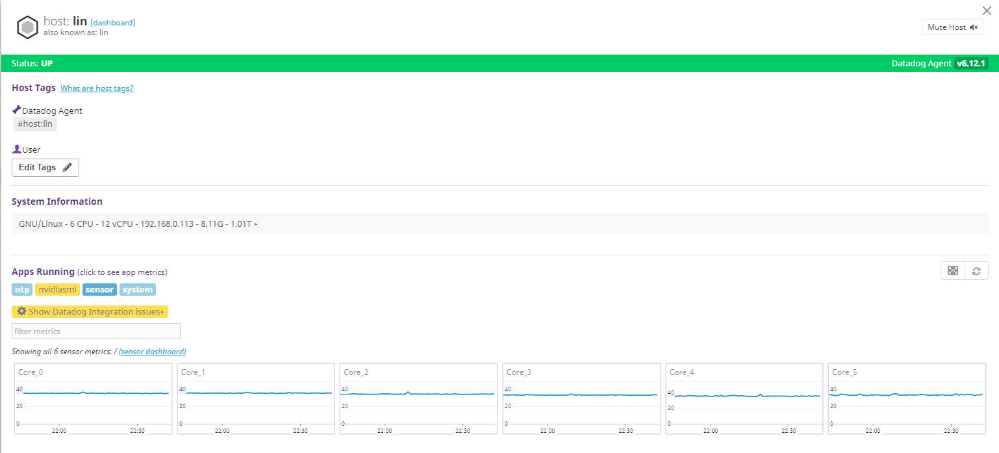

# datadog-sensors

將[lm-sensors](https://github.com/lm-sensors/lm-sensors)的CPU溫度資料回報到[datadog](https://www.datadoghq.com/)上

## 需求

此外掛透過[plumbum](https://plumbum.readthedocs.io/en/latest/)與linux shell互動，抓取溫度資料，所以需在datadog的python資料夾中安裝plumbum

```
/opt/datadog-agent/embedded/bin/pip install plumbum
```

## 安裝教學

* 複製下列兩個檔案到datadog-agent目錄中

  ```
  cp sensor.yaml /etc/dd-agent/conf.d/
  cp sensor.py /etc/dd-agent/checks.d/
  ```

* 更改兩個檔案的所有者為dd-agent

  ```
  chown -R dd-agent:dd-agent /etc/datadog-agent
  ```

* 重新啟動datadog-agent

  ```
  systemctl restart datadog-agent
  ```

* 測試

  ```
  datadog-agent check sensor
  ```

  出現ok字樣即安裝成功，稍待幾分鐘即可於datadog平台得到資料

## 演示

